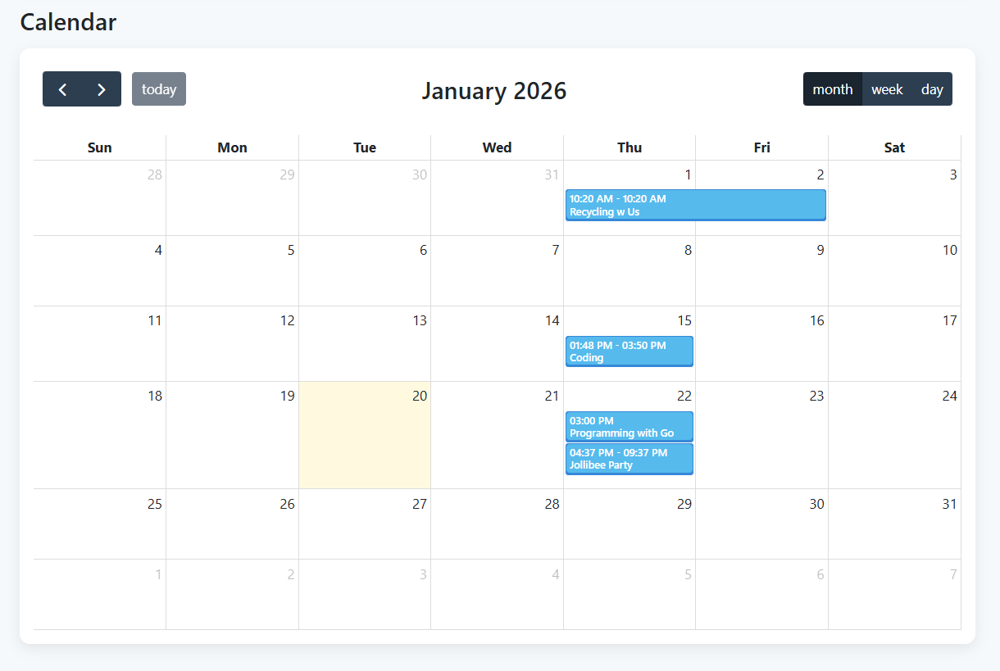
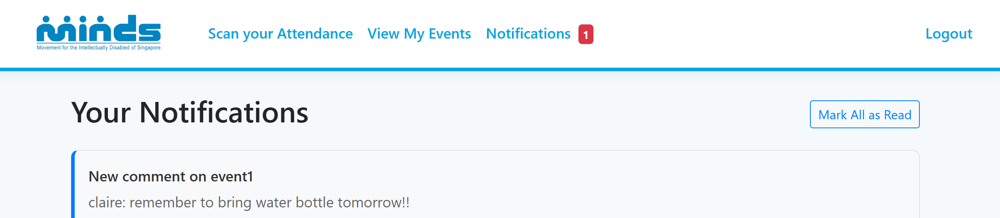

# **Project OneMINDS System**

**Problem Statement:**  
How might we reduce friction in activity sign-ups for both individuals and caregivers, while reducing manual effort for staff in managing and consolidating registration data?

This project is built to streamline **MINDS’ day-to-day event operations**, helping staff, volunteers, and participants manage registrations, attendance, and engagement efficiently.


# **Intro**

Participants across different programmes often register separately for activities through different web-based forms, resulting in inefficiencies in centralising registration. Volunteers also register via spreadsheets or email, with no consolidated system. Staff manually create schedules with Excel sheets, track attendance, and contact caregivers, which is time consuming.

OneMINDS centralizes event management, automates registration processes, tracks attendance, and improves engagement and interaction between MINDS, volunteers and participants.


## **Tech Stack**

* **Front-end**  
  * ASP.NET Core MVC  
  * Bootstrap 5  
* **Back-end**  
  * NET 6 (C\#)  
  * Firebase Admin SDK for authentication  
* **Database**  
  * Firebase Firestore  
* **Authentication**  
  * Firebase Authentication


## **Features**

* **Role-Based Access Control**
  * Staff  
  * Volunteer  
  * Participant
    
* **Automated emails**  
  * Applying to be a potential client of MINDS: Organisation to Clients
  * Applying to be a volunteer of MINDS: Organisation to Volunteers
  * Creating a new account for new staff: Organisation to New Hires

* **Calendar**  
  * Participants/Volunteers are able to view and register for events
  * Staff is able to visualize the overview of all available events throughout the year

    

* **Event Management** 
  * Staff create events, indicating maximum participants, registration due dates, etc. and view them

    

* **Participants Management** 
  * Staff can manage participant’s engagement

      
  
  * Staff also manages user accounts – they are able to deactivate accounts  
  * Staff may also view potential participants, accept/reject registrations  
  * Waitlist management based on event max participants  

* **Centralised Reports**  
  * Export to Excel sheet function for more portability \- separating the list of confirmed participants, waitlisted participants and volunteers of the filtered event.   
  * Event Registrations – records payment status, waitlist status and attendance, etc.

    

* **Sign-up, Login, Reset password**  

* **Attendance Check-in with Built in QR Code Scanner**  
  * Staff is able to generate attendance QR code for each event  
  * Participants are able to use QR code scanner to mark their attendance seamlessly

    

* **Event Forum**  
  * Participants/Volunteers can view their registered events here and post comments

      

* ***Notifications***  
  * In-app notifications for event forum activity

    


## **How Does It Work?**

1. **Staff Workflow:**  
   * Events  
     1. Create an event → Specify max participants & registration due date → Generate QR code → Track attendance and volunteer engagement  
     2. View reports and export information to Excel  
   * Manage users  
     1. Fill up application forms→ Send emails to respective recipients along with their credentials  
     2. Accept/reject registrations   
2. **Participant / Volunteer Workflow:**  
   * Sign up → Browse available events → Register → Scan QR code to check in → Participate in event


## **Getting Started**

### **Prerequisites**

* [.NET 6 SDK](https://dotnet.microsoft.com/download/dotnet/6.0)  
* IDE  
* NuGet Packages: QRCoder  
* Gmail Account

### **Setup**

1. Clone this repository  
2. Move the given file into the following directory
```
squad-60b0b-firebase-adminsdk-fbsvc-cff3f594d5

H4G\_Project/DAL/config
```
3. Go to your Google Account settings and set up 2MFA.  
4. Go to your Security settings, find the "App passwords" section, Enter an app name and click “Create” to generate the 16-digit code.  
5. Go to the appsettings.json file in the project directory:
```
H4G\_Project/appsettings.json 
```
6. Paste the 16-digit code into xxx.  
7. Run the application:
```
dotnet run
```
8. Access the web app at:
```
https://localhost:7080 or https://localhost:7080
```


## **Try It\!**

**Existing Accounts**  
**Participant**: woof@gmail.com (password: woofwoof)  
**Staff**: rice@minds.com (password: ricerice)  
**Volunteer**: meow@gmail.com (password: meowmeow)


## **What’s Next**

* Mobile-friendly interface for participants and staff  
* Push notifications for event updates  
* Personalized event recommendations  
* More advanced volunteer scheduling and task assignment  
* Analytics dashboard for event participation and engagement trends


## **Inspiration**

Inspired by MINDS’ mission to provide holistic support for participants across programmes, oneMINDS reduces manual labour, improves registration efficiency, and ensures accurate attendance tracking.

*OneMINDS Developers: Clarice O. | Claire T. | Jia Yi H. | Xin Yin O.*  
